# Chaos Engineering кластера 

## Предисловие
---
Все тесты проводились на нагруженной системе с использованием тестового сценария в Gatling. Нагрузка на систему составляла 400 запросов в секунду (rps).

## Задачи
---
### 1. Отключение узла

**План:**
- Остановить один из узлов кластера, чтобы проверить процедуру переключения ролей (failover).
- Проанализировать время, необходимое на восстановление,a также как система выбирает новый Master узел (и есть ли вообще там стратегия выбора?).

**Описание эксперимента:**
1. Определение лидера с использованием дашборда Patroni-exporter.
2. Через интерфейс MTS Cloud перезапуск VM, которая в данный момент является лидером.
3. Переход в Grafana для анализа ситуации.

**Ожидаемые результаты:**
Ожидается, что при выходе из строя или недоступности мастера, реплика возьмет на себя ее роль, и это не сильно скажется на доступности системы за счет низкого времени реагирования.

**Реальные результаты:**
etcd определил недоступность мастера и переключил его в течение 0.15 секунд.

---
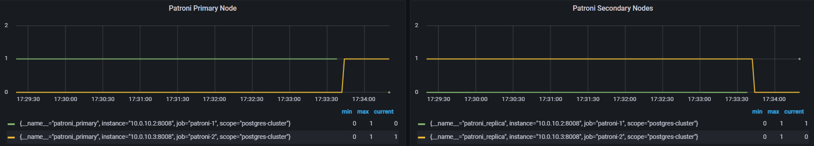
---
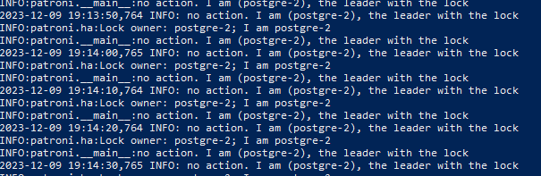

**Анализ результатов:**
Результаты тестирования показали отсутствие некорректной работы кластера PostgreSQL и etcd.

### 2. Имитация частичной потери сети
**План:**
- Заблокировать порт 5432 для tcp между узлами patroni
- Проанализировать поведения системы

**Описание эксперимента:**
1. Фиксация состояния кластера через dashboard-patroni в  Grafana 
2. Заблокировать порт 5432 на вм 
```shell
iptables -t nat -A PREROUTING -p tcp -j REDIRECT --to-ports 5432
```
3. Проверки dashboard на то, что система перестала видеть реплику и мастер
4. Разблокировать порт
```shell
iptables -t nat -D PREROUTING -p tcp -j REDIRECT --to-ports 5432
```
5. Анализ поведения системы

**Ожидаемые результаты:**
Ожидается, что при потере соединения с узлами,etcd будут проводить выборы мастера, как только порты снова станут открытыми etcd назначит master и кластер будет работать в штатном режиме 

**Реальные результаты:** 

---
Отключение портов:
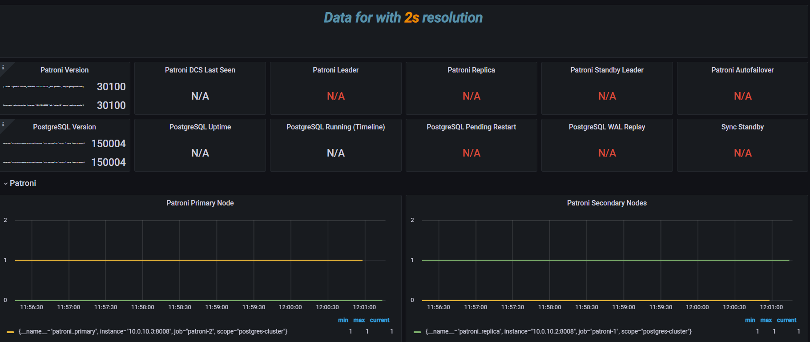

Включение портов:
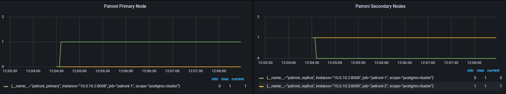

---

**Анализ результатов:**
Опираясь на графики было установлено, что система за 10 секунд приходит к рабочему состоянию и после задержки от 0.15 - 1с  начинает репликацию данных

### 3.  Высокая нагрузка на CPU

**План: **
- Запустить процессы, которые создают высокую нагрузку на CPU
- Проанализировать поведения системы

**Описание эксперимента:**
1. Определение лидера с использованием дашборда Patroni-exporter.
2. Нагрузка вм при помощи утилиты Chaosblade
```shell
blade create cpu load --cpu-percent 95 --timeout 600
```
3. Переход в Grafana для анализа ситуации.

**Ожидаемые результаты:**
Ожидается, что при высокой нагрузке сменится лидер и система будет работать в штатном режиме

**Реальные результаты:**
В реальности лидер не сменился, из-за чего усугубилось время ответа на запросы, однако сервис работал в штатном режиме 

---
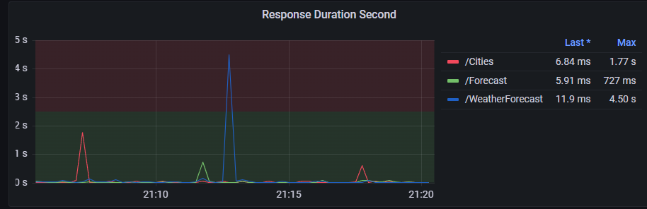
---
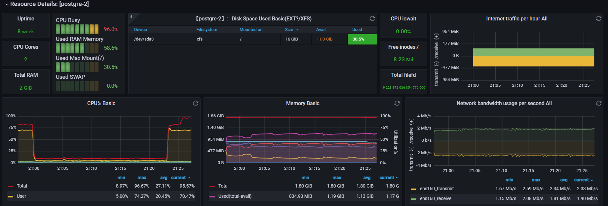

**Анализ результатов:**
Думая над этой ситуацией, я пришел к тому, что желательно в таких ситуациях переносить нагрузку на реплику для чтения запросов или же полного смены мастера, если это не критично для пользователя, так как при получении ещё большей нагрузки вм может упасть, в результате чего произойдёт потеря данных, также в периоды нагрузки достаточно трудно держать приемлемое отставание в данных между мастером и репликой.


### 4.  Тестирование систем мониторинга и оповещения: 

**План:**
- Запустить процессы, которые создают высокую нагрузку на CPU и Patroni
- Дать небольшую нагрузку на систему алертирования для проверки её работы в псевдо боевой ситуации
- Перезагрузить ВМ
- Проанализировать поведения системы

**Описание эксперимента:**
1. Проверить корректность работы настроенных алертов 
2. Нагрузка вм при помощи утилиты Chaosblade
```shell
blade create cpu load --cpu-percent 60 --timeout 600
blade create mem load --mode ram --mem-percent 65 --timeout 600
```
3. Анализ алертов в Alertmanager

**Ожидаемые результаты:**
Ожидается, что при высокой нагрузке и недоступности вм, отправится alert для уведомления о проблеме

**Реальные результаты:**
Алерты отработали корректно и при недоступности в 1 m сообщения об аварии были доставлены 

---
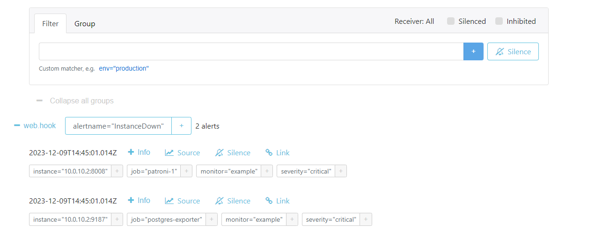
---

**Анализ результатов:**
Система Alertmanager при заданных условиях сработала корректно, в результате чего ожидаемые и реальные тесты сошлись, однако необходимо также учитывать, что  система может повести себя некорректно при высокой нагрузке того хоста , на котором она установлена 

### 5.  Split brain: 

в процессе

### 6.  Долгосрочная изоляция:  

**План:**
- Отключение реплики на длительный период
- Восстановление реплики 
- Анализ поведения системы по восстановлению 

**Описание эксперимента:**
1. Зафиксировать , что происходит репликация данных 
2. Отключение вм  с репликой на 30 мин - 1 час при помощи интерфейса MTS Cloud
3. Обратное включение узла в кластер
4 Анализ результатов

**Ожидаемые результаты:**
Ожидается, что после включения реплики patroni запустит систему по репликации данных и вернет бд к консистентному состоянию.

**Реальные результаты:**
После отключения и включения, реплика начала получать данные от мастера, lag который возник при включении, оказался не существенным, так как основная доля запросов, которая летит в api - get запросы. 

---
 Информации в момент до и после отключения реплики: 

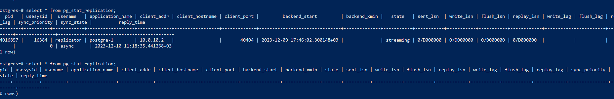

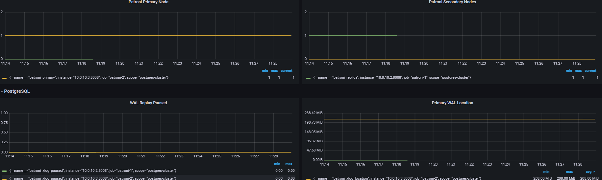
---
Информации после включения реплики:

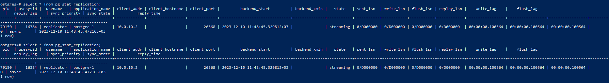

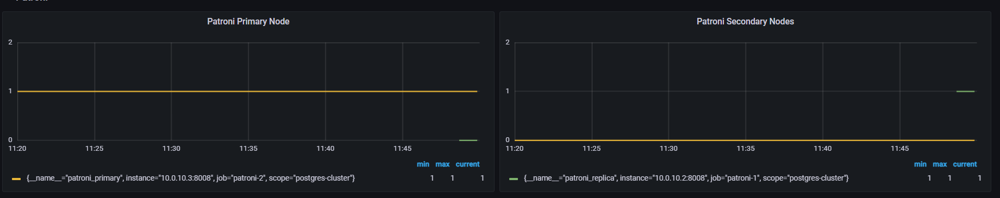

**Анализ результатов: **
На основе полученных данных сделан вывод, что система повела себя корректно и не вызвала ухудшений в работе при отказе реплик. 


### 7.  Сбои сервисов зависимостей:  

**План:**
Изучить поведение кластера Patroni при сбоях в сопутствующих сервисах, например, etcd (которые используются для хранения состояния кластера),
путем имитации его недоступности или некорректной работы. 

**Описание эксперимента:**
1. Зафиксировать нормальное состояние системы
2. Выводи из строя двух инстансов etc
3. Анализ полученных результатов


**Ожидаемые результаты:**
Ожидается, что после включения etcd не получится смены mater и replica

**Реальные результаты:**
Получили ситуацию split-brain и оба инстанса стали read only, что привело к некорректному ответу на post запросы.

---
 Информации в момент отключения etcd: 

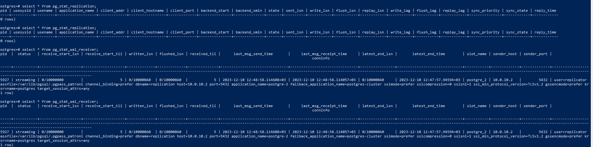

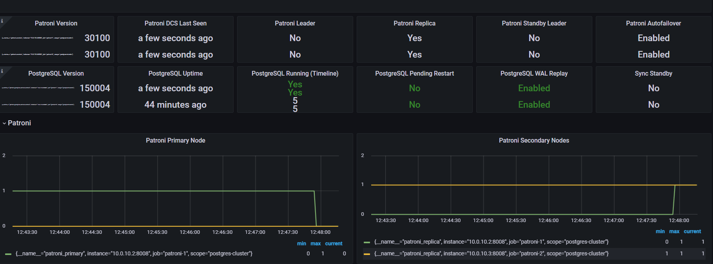
---

**Анализ результатов:**
Полученные результаты стали для меня сюрпризом, так как до этого я не сталкивался с работой etcd и ожидал, что даже 1 инстанс etcd  сможет определить master и не допустит split-brain между двумя инстансами patroni . Анализируя данный эксперимент, я пришел к выводу, что для системы будет критичен выход из строя 2х etcd , в результате чего она начнет некорректно отрабатывать запросы на запись.
